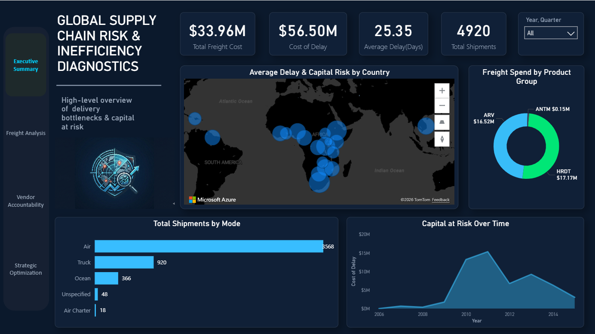
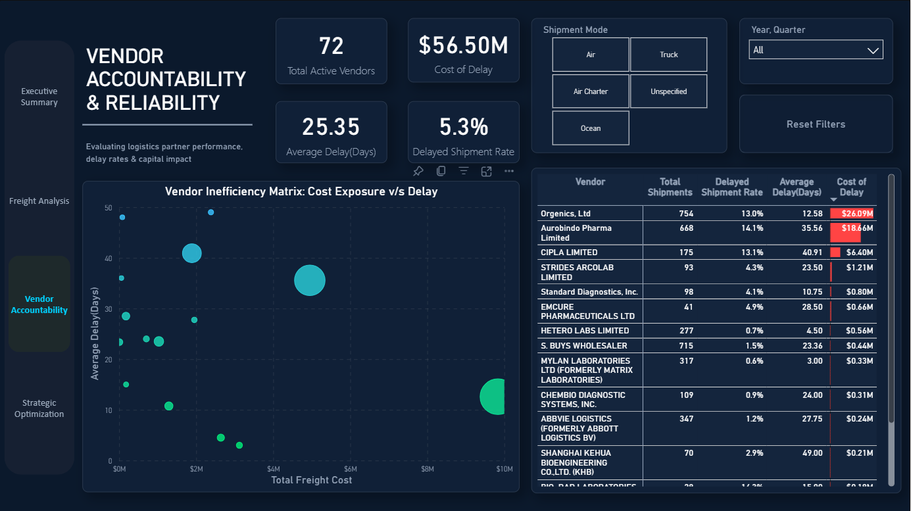
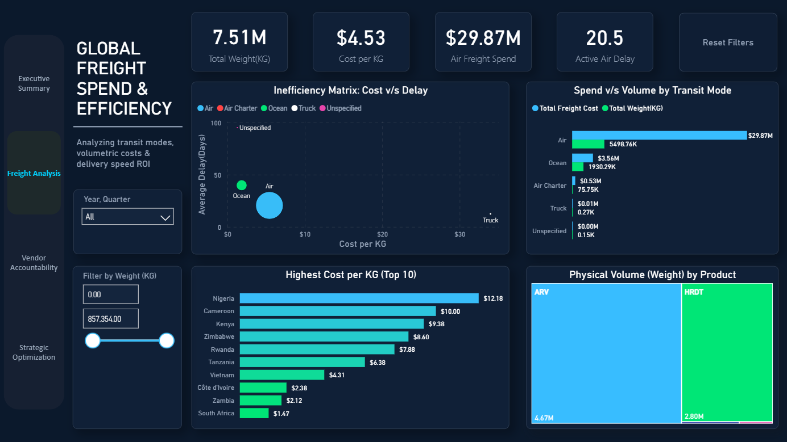
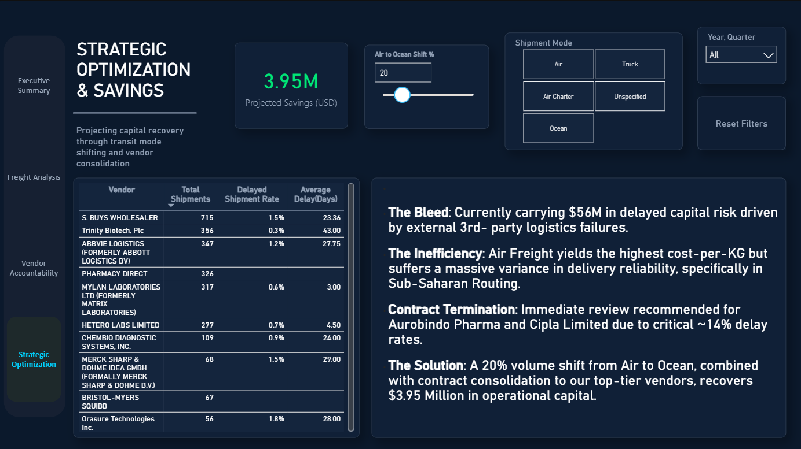

# Supply Chain Capital Recovery & Optimization
### Power BI Capstone Project | Zoople Technologies — Formally Assessed & Approved, 2026

---

## Project Overview

A fully interactive, 4-page Power BI executive platform built to diagnose supply chain risk, vendor inefficiency, and capital loss across a global pharmaceutical delivery network.

The core problem: **$202M in internal routing data noise** was masking real, actionable third-party vendor failures. This platform cuts through that noise, surfaces the true risk exposure, and delivers a strategic recovery path — built entirely for C-suite decision-making.

📌 **View the LinkedIn project post here:** https://www.linkedin.com/posts/abhinashokda_dataanalytics-powerbi-supplychain-ugcPost-7457354780869533696-XVKR?utm_source=share&utm_medium=member_desktop&rcm=ACoAADI4q_cB1esqc4jkt8WTBT7-DKXCqBOu794

---

## Key Findings at a Glance

| Metric | Value |
|---|---|
| Total Shipments Analysed | 4,920 |
| Total Vendors Evaluated | 72 |
| Delayed Capital Risk Surfaced | $56.5M |
| Highest Risk Vendor (Cost Exposure) | Aurobindo Pharma — $18.66M |
| Aurobindo Delay Rate | 14.1% |
| Cipla Limited Delay Rate | 13.1% |
| Highest Cost-per-KG Country | Nigeria — $12.18/KG |
| Projected Recoverable Capital (20% Air-to-Ocean Shift) | $3.95M |

---

## Dashboard Pages

### Page 1 — Executive Summary
High-level overview of total freight cost, cost of delay, average delay days, and total shipments. Includes a global map visualising average delay and capital risk by country, shipment breakdown by transit mode, and capital-at-risk trend over time.

### Page 2 — Freight Analysis (Global Freight Spend & Efficiency)
Analyses transit modes, volumetric costs, and delivery speed ROI. Features an Inefficiency Matrix (Cost vs Delay by transit mode), highest cost-per-KG by country (Top 10), and physical volume by product group. Air freight identified as highest cost-per-KG with significant delivery variance in Sub-Saharan routing.

### Page 3 — Vendor Accountability & Reliability
Evaluates all 72 logistics partners by performance, delay rates, and capital impact. Custom bubble-matrix plots every vendor by Total Freight Cost vs Average Delay. Aurobindo Pharma and Cipla Limited flagged for immediate contract review based on combined delay rate and cost exposure.

### Page 4 — Strategic Optimization & Savings
Projects capital recovery through transit mode shifting and vendor consolidation. Live DAX-driven savings simulator — adjustable Air-to-Ocean freight shift percentage with real-time projected savings output. A 20% volume shift projects **$3.95M in recoverable operational capital.**

---

**Live Dashboard:**[View Interactive Report on Power BI Public]https://app.powerbi.com/groups/aef0c5ca-e09e-4557-be04-ec6f34dd8273/reports/c8b50180-a158-4375-bfa5-58e0043bba50?experience=power-bi&redirectedFromSignup=1

---

## Screenshots

| Executive Summary | Vendor Accountability |
|---|---|
|  |  |

| Freight Analysis | Strategic Optimization |
|---|---|
|  |  |

---

## Tools & Technologies

| Tool | Usage |
|---|---|
| **Microsoft Power BI** | Dashboard design, interactivity, visualisations |
| **Power Query (M Language)** | All data cleaning, transformation, and noise purging |
| **DAX** | Custom measures, KPIs, savings simulator logic, conditional formatting |
| **Data Modelling** | Star schema design, table relationships, optimised for BI reporting |

---

## Data Source

**SCMS Delivery History Dataset** — publicly available supply chain dataset covering pharmaceutical product delivery records across global routes and vendors.
SCMS (Supply Chain Management System) is used by gloabl health organizations including USAID-funded programs to manage pharmaceutical and medical supply logistics.

- Source: SCMS (Supply Chain Management System) — public dataset
- Records: 10,000+ delivery rows pre-cleaning
- Post-cleaning: Reduced to actionable, third-party vendor records only after purging $202M in internal routing noise via Power Query

---

## Data Cleaning & Transformation (Power Query)

All cleaning was performed entirely inside Power BI using Power Query — no external preprocessing tools used.

Key transformation steps:

- **Noise Purging** — Identified and removed $202M in internal routing transactions to isolate third-party vendor failures exclusively
- **Column Standardisation** — Standardised date formats, vendor names, and shipment mode labels across inconsistent source entries
- **Null Handling** — Addressed missing freight cost and delay values with contextually appropriate treatments
- **Calculated Columns** — Created Cost of Delay, Capital at Risk, and Cost-per-KG fields as foundational measures for all downstream analysis
- **Data Type Enforcement** — Enforced correct data types across all columns to prevent silent calculation errors in DAX

---

## DAX Highlights

Key measures engineered for this project:

- **Cost of Delay** — Dynamic calculation of capital locked in delayed shipments across any filter context
- **Delayed Shipment Rate %** — Vendor-level delay rate as a percentage of total shipments
- **Projected Savings Simulator** — Parameterised DAX measure accepting a user-defined Air-to-Ocean shift % and returning projected capital recovery in real time
- **Capital at Risk Over Time** — Time-intelligence measure tracking delayed capital exposure across years and quarters
- **Cost per KG** — Freight spend normalised by shipment weight for cross-country and cross-mode efficiency comparison

---

## Project Structure

```
supply-chain-risk-powerbi/
│
├── scms_delivery_history.pbix    # Full Power BI file (download to explore)
│
├── screenshots/
│   ├── executive_summary.png
│   ├── freight_analysis.png
│   ├── vendor_accountability.png
│   └── strategic_optimization.png
│
└── README.md
```

---

## How to Open the Project

1. Download and install [Microsoft Power BI Desktop](https://powerbi.microsoft.com/desktop) (free)
2. Clone or download this repository
3. Open `scms_delivery_history.pbix` in Power BI Desktop
4. All data, transformations, and DAX measures load automatically — no additional setup required

---

## About

**Abhin Ashok** — Data Analyst

Calicut, Kerala | [LinkedIn](https://linkedin.com/in/abhinashokda) | [GitHub](https://github.com/AbH1-N) | abhinashok.nalloor@gmail.com

Completed Advanced Data Analytics Certification at Zoople Technologies. Open to Data Analyst opportunities.

---

*This project was formally assessed and approved by Zoople Technologies, 2026.*
